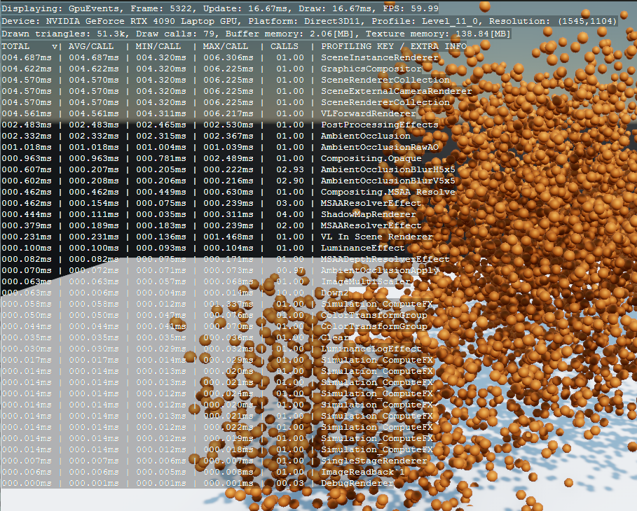
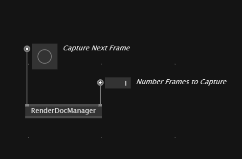
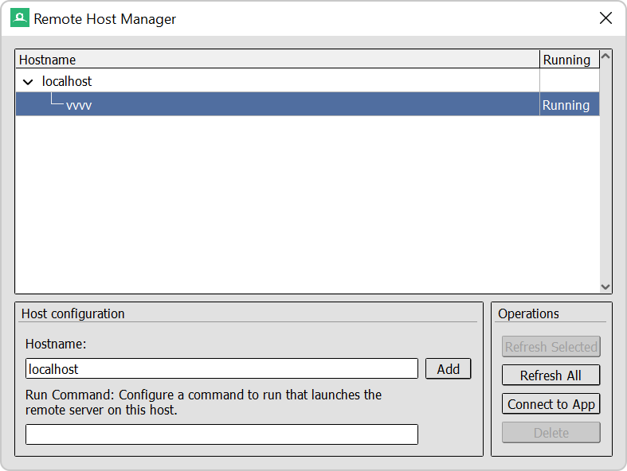
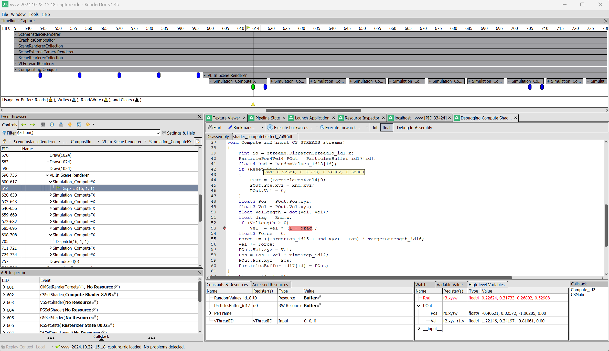
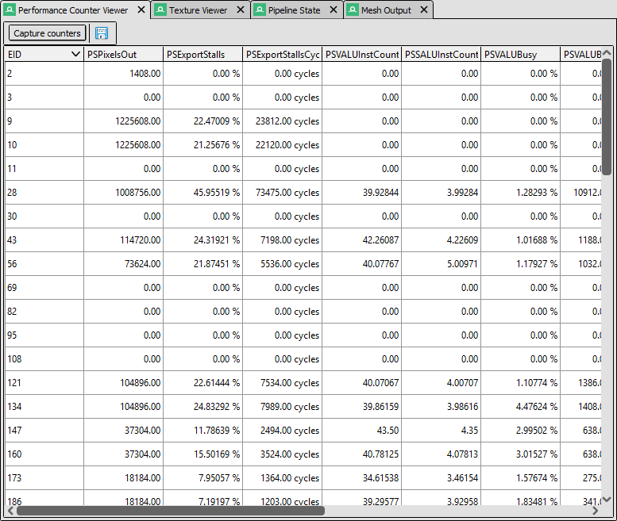

## GPU Debugging in vvvv

This guide explains the two main options for GPU debugging in vvvv. You can use either:

- The **Stride Profiler**: A simple, real-time tool built into vvvv that provides quick insights into performance and resource usage.
- **RenderDoc**: A more detailed tool for frame-by-frame debugging, allowing you to inspect GPU calls, capture frames, and analyze shaders in-depth, though not in real-time.

Both tools can help you identify performance bottlenecks and issues, depending on the level of detail you need. They can also be used together.

### Performance Profiling with the Stride Profiler

The [**Stride Profiler**](https://doc.stride3d.net/4.2/en/manual/troubleshooting/profiling.html) is a built-in tool in vvvv that allows you to quickly assess performance in real time. It gives an overview of which parts of a patch are consuming the most resources.

To enable the Stride Profiler, press **F3** in any Stride window. A small text display will appear in the top left corner showing the **current framerate** (FPS).
  
#### Navigating the Profiler

You can view different performance details by switching between pages with **F5**:
- **FPS Page**: Displays the current framerate.
- **CPU Page**: Lists CPU performance
- **GPU Page**: Lists GPU performance

#### Sorting and Viewing Details
by default, the entries are sorted by time taken (longest calls/actions listed first).
- **F6**: Switches the sorting order between performance length (default) and action name.
- **1, 2, 3, 4 Keys**: Switch between multiple pages if there are more logs than can fit on one page.

#### Profiler Key Input

Each shader or renderer in a patch has a **Profiler Key Input**. Entering a unique name in this input makes it easier to track the performance of specific elements in the Profiler window.

The Stride Profiler is particularly helpful for quickly identifying which parts of a patch have the highest performance cost. It provides a quick and efficient way to monitor performance without the need for external tools.

### Detailed Debugging with RenderDoc

For more in-depth GPU debugging, you can use **RenderDoc**. This tool allows you to capture individual frames and inspect GPU calls, shaders, and other detailed aspects of rendering that aren't visible in real-time with the Stride Profiler.

#### Prerequisites

1. **Install RenderDoc**: Before using the RenderDocManager in vvvv, you must install RenderDoc. Download the latest version here: [Download RenderDoc](https://renderdoc.org).

2. **Start vvvv with the Debug Flag**:
   - vvvv must be started with the `--debug-gpu` flag.
   - This flag does the following:
     1. Enables the connection between RenderDoc and vvvv.
     2. Initializes the graphics device in **debug mode**, necessary for providing detailed GPU information to RenderDoc.

#### Using the RenderDocManager in vvvv

##### 1. Setting Up the RenderDocManager Node

Once vvvv is running with the `--debug-gpu` flag, open any patch that references **VL.Stride**, and add the **RenderDocManager** node.

##### 2. Enabling the Stride Profiler

Before capturing frames, enable the **Stride Profiler** as described above.

It doesn’t matter which page is currently displayed, but the profiler **must be enabled** for RenderDoc to get detailed information for organizing GPU calls.

##### 3. Capturing Frames

- **Single Frame Capture**: Trigger the **Capture Next Frame** input to capture the next frame rendered by the GPU. This frame is stored for later analysis in RenderDoc.
  
- **Multiple Frame Captures**: Use the **Number of Frames to Capture** input to capture a series of successive frames. This is particularly useful when debugging recurring issues like periodic frame drops or performance dips. For example, if a problem occurs every `n` frames, you can set the number of frames to `n` and capture the relevant frames for analysis.

### Attaching RenderDoc to vvvv

1. Start RenderDoc.
2. Go to **File** > **Attach to Running Instance**.
3. In the pop-up window, look for **localhost** and find **vvvv** underneath it.
4. Double-click **vvvv** to connect RenderDoc to the vvvv instance and access the captured frames. If no frames have been captured yet, nothing will appear, but you can trigger frame capture from vvvv or directly in RenderDoc.

### Debugging Captured Frames in RenderDoc

Once frames are captured and loaded in RenderDoc:
1. **Double-click** on a captured frame:
   - RenderDoc will analyze the frame, which may take a few seconds.
   - You will see all GPU calls made by vvvv during that frame.

2. **Timeline**: At the top of the RenderDoc interface, a timeline displays the sequence of GPU events.

3. **Draw Calls and Pipeline State**: Below the timeline, you’ll find the draw calls and the pipeline state, where you can inspect shaders, resources, and other rendering details.

4. **Shader Debugging**: 
   - To debug pixel, vertex, or compute shaders, go to the **Pipeline State** section.
   - For more information on debugging shaders in RenderDoc, refer to their official guide: [Shader Debugging in RenderDoc](https://renderdoc.org/docs/how/how_debug_shader.html).

### Performance Profiling with RenderDoc

RenderDoc also provides performance counters that help assess GPU performance metrics for specific frames. These counters give you deeper insights into which GPU calls are the most performance-heavy.

#### 1. Enabling the Performance Counter Viewer

- Go to **Window > Performance Counter Viewer** in RenderDoc.
- In this view, you can access different GPU counters, including generic counters and **Nvidia-specific counters**.

To enable Nvidia-specific counters:
1. Download the **Nsight Perf SDK** from the official Nvidia page: [Nsight Perf SDK](https://developer.nvidia.com/nsight-perf-sdk).
2. Extract the SDK contents.
3. Copy the `nvperf_grfx_host.dll` file to the following directory:
`C:\Users\YourUsername\AppData\Roaming\renderdoc\plugins\nv\nvperf_grfx_host.dll`
4. Reopen the frame capture in RenderDoc.
  
Once enabled, you can perform **Sample Counters** on captured frames. This will generate a detailed list showing various performance metrics, such as the time taken in milliseconds for specific GPU calls.

#### 2. Analyzing Performance Counters

- The Performance Counter Viewer will display metrics like time, memory usage, and other performance-related data.
- Clicking on the **EID** (Event ID) in the list allows you to jump to the relevant call in the timeline or the draw call list for deeper inspection.

For more information on how to use the Performance Counter Viewer, refer to the official RenderDoc documentation: [Performance Counter Viewer in RenderDoc](https://renderdoc.org/docs/window/performance_counter_viewer.html).

For further details on using RenderDoc, including advanced features like shader debugging and performance counters, refer to the official [RenderDoc documentation](https://renderdoc.org/docs/).
